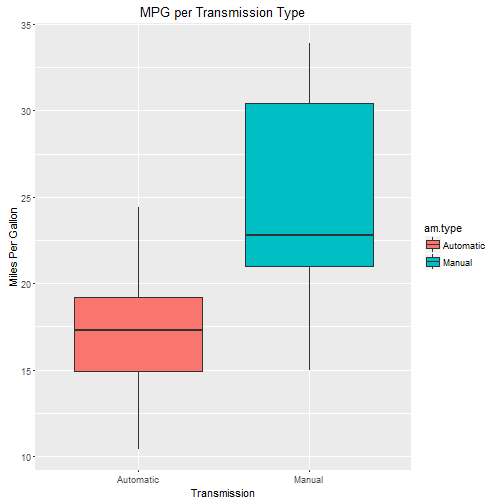

Let Us Perform Some Arithmetic Calculations
========================================================
author: W Wocher
date: Wed May 25 15:31:27 2016

So You Do Not Like Doing Math
========================================================

Here is the tool that will solve all your problems.

- It Displays 2 Values
- It Adds 2 Values
- It Subtracts 2 Values
- It Multiplies 2 Values

How To Run The Application
========================================================
You can find the Application at this URL : https://wocherw.shinyapps.io/dataproducts/

There is also a nice file to read here : https://github.com/wocherw/dataproducts/blob/master/Shiny_Math.pdf

You can also find the complete code here : https://github.com/wocherw/dataproducts


Fun Things with Presentations
========================================================
Here is some information about cars.  Who doesn't like cars?!


```r
summary(cars)
```

```
     speed           dist       
 Min.   : 4.0   Min.   :  2.00  
 1st Qu.:12.0   1st Qu.: 26.00  
 Median :15.0   Median : 36.00  
 Mean   :15.4   Mean   : 42.98  
 3rd Qu.:19.0   3rd Qu.: 56.00  
 Max.   :25.0   Max.   :120.00  
```

Comparison of Automatic and Manual Transmissions
========================================================

 
